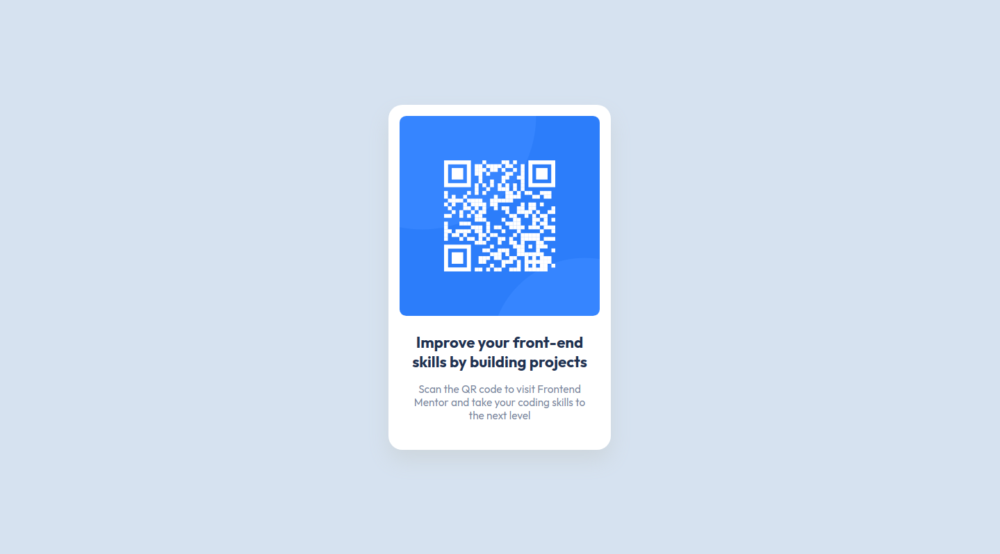

# Frontend Mentor - QR code component solution

This is a solution to the [QR code component challenge on Frontend Mentor](https://www.frontendmentor.io/challenges/qr-code-component-iux_sIO_H). Frontend Mentor challenges help you improve your coding skills by building realistic projects.

## Overview

### Screenshots

## My process

### Built with

- Mobile-first workflow
- CSS custom properties

### What I learned

This was a small refresher after not using CSS for a few months.